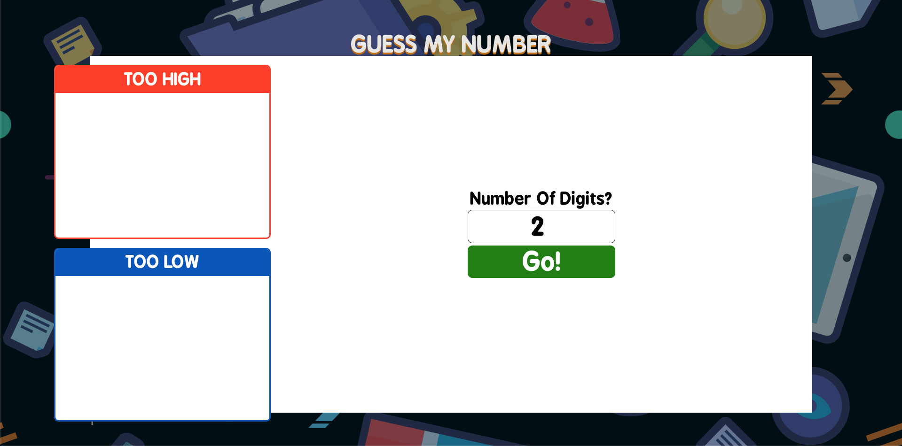

# Guess Number

Front-End Application

## Key Features:

- React Front-End
- Jest Testing

## Screenshot

## Try

[Try it now](https://adamfarver-guessnumber.herokuapp.com)

*This deployment is hosted on Heroku's Free Tier and may take up to a minute to
spin up.*
## What

Guess Number is a simple application that facilitates learning number
place values. It keeps a running list of the guesses and whether they
are higher or lower than the target number.

## Technologies

- ReactJS - General Interface Library
- ReactJS Context API - App State
- Formik - Form Inputs
- Jest - Unit Tests
